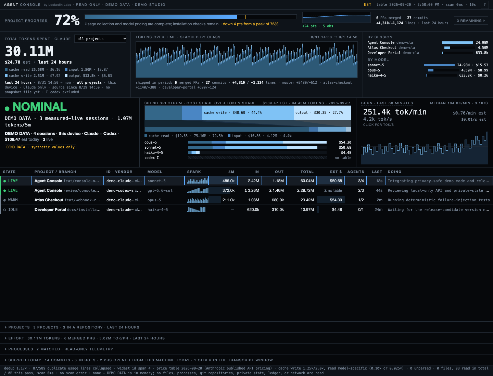

# Agent Console

**See what your AI coding agents are doing—and what they consume.**

A local observability console for Claude Code and Codex. Keep it open beside
an editor to watch sessions, subagent activity, models, token usage, estimated
API costs, and delivery evidence across the projects on your machine.



*The actual console, running in demo mode. Every value in this image is synthetic.*

No account, API key, coordination protocol, or build step. Node's standard
library handles collection and serving; the interface uses plain HTML, CSS,
and JavaScript. **Zero runtime dependencies. MIT licensed.**

## Install and open

Requires **Node.js 18 or newer** and Git. A current Node LTS is recommended.
macOS and Linux are the supported collection environments. On Windows,
process telemetry is unavailable; Windows is not a verified release target.

```sh
git clone https://github.com/SamSnead85/agent-console.git
cd agent-console
node bin/agent-console.mjs --open
```

Your browser opens `http://127.0.0.1:6787`. Leave the terminal running; Ctrl+C
stops the collector. You do not need to run `npm install` from this checkout.

For a globally installed command, use the tested GitHub release artifact:

```sh
npm install --global https://github.com/SamSnead85/agent-console/releases/download/v0.1.0/lockedinlabs-agent-console-0.1.0.tgz
agent-console --open
```

This release is distributed through **GitHub**, not the npm registry. There is
no native desktop installer yet. Download the source ZIP from GitHub if you
prefer not to clone; extract it and run the same Node command inside the folder.

To explore without reading any of your sessions:

```sh
node bin/agent-console.mjs --demo --port 6790 --open
```

Demo mode uses an isolated synthetic data source: no transcript scans, process
inspection, Git reads, outgoing requests, or history writes.

## What you can see

- **Sessions and subagents:** project, branch, model, recent activity, parent
  session details, and child-agent usage. Expand a session to inspect its tree.
- **Token composition:** input, output, cache creation, and cache reads as
  distinct classes; rolling periods and project filters.
- **Cost estimates:** model-specific Claude API rates, including Fable 5.1's
  cache rate. Unpriced usage stays visible as unknown, not a free session.
- **Activity over time:** token history, live burn, and recent baselines. Hover
  a history bucket to inspect its token breakdown.
- **Delivery evidence:** local commits, changed lines, and available pull
  request evidence. These are observations, not productivity scores.
- **Pressure signals:** unusually high burn, retries, compactions, quota
  pressure, and stalled-session heuristics, with definitions in the `?` panel.

The compact dark instrument-panel interface is the product. Search sessions,
change the period/project, switch burn units, and expand details without leaving
it. Your browser retains view preferences. [Phone screenshot](docs/console-mobile.png).

## Understand the numbers

| Reading | Meaning |
| --- | --- |
| Rolling headline | Claude usage in the selected period, on this machine's disk |
| Claude session row | Local-calendar-day usage, including its recorded subagents |
| Codex `Σ` row | Thread-lifetime counters; **excluded** from period totals |
| Estimated dollars | Standard Claude API-equivalent token cost, **not** a subscription invoice |
| Unpriced | No verified model rate; partial estimates do not include that usage |
| Live / stalled | Derived from transcript activity and available process evidence |

A large cache-read share is not itself waste: long-running agents reuse context
on successive requests. Input cache reuse and cache share of all tokens are
different metrics. Neither measures engineering productivity.

**One machine today.** The console does not collect another laptop's logs or
aggregate a team. Copied logs may carry history from elsewhere. Shared identity,
origin tracking, cross-device deduplication, and team aggregation are future work.

Read [the measurement contract](docs/MEASUREMENTS.md) for sources, time windows,
deduplication, and limits. No OpenAI cost table is included in this release.

## Configure collection

```sh
# Faster display refresh; deeper transcript discovery
agent-console --poll-ms 5000 --window-hours 168

# Custom source directories (local or explicitly mounted)
agent-console --claude-root /path/to/claude/projects --codex-root /path/to/codex/sessions

# Scan another local home; keep derived history in a chosen directory
agent-console --home /path/to/home --history-dir /path/to/private-history

# Include local delivery evidence from a project
agent-console --repo /path/to/project
```

| Option | Default / purpose |
| --- | --- |
| `--port` | `6787`; always binds `127.0.0.1` |
| `--poll-ms` | `10000`; browser refresh interval |
| `--window-hours` | `72`; transcript file discovery window |
| `--home` | Current user's home |
| `--claude-root` | `<home>/.claude/projects` |
| `--codex-root` | `<home>/.codex/sessions` |
| `--history-dir` | `~/.muster-console` (legacy state location retained) |
| `--repo` | Current directory; no Git repository is required |
| `--demo` | Isolated synthetic tour |
| `--open` | Open the browser |
| `--embed` | Exact allowed origins for embedding; off by default |
| `--github` | Opt in to legacy GitHub checks; may contact GitHub |
| `--muster` | Opt in to a legacy coordination ledger; may contact its Git remote |
| `--no-muster` | Explicitly disable ledger access |
| `--json` | Print launch metadata; keep the server running |

Collection settings also accept `AGENT_CONSOLE_` environment variables:
`PORT`, `POLL_MS`, `WINDOW_HOURS`, `HOME`, `CLAUDE_ROOT`, `CODEX_ROOT`,
`HISTORY_DIR`, `REPO`, `EMBED`, `DEMO`, and `MUSTER`.
Use `agent-console --help` for the full command reference.

## Privacy and embedding

The default console reads local session logs and serves them only on loopback.
It sends no analytics. Known credential patterns are redacted before responses
reach the browser, but session labels and activity can still be sensitive.
Use demo mode for public screenshots and presentations.

A dependency-free `<agent-console-panel>` can be embedded in another local
application. Start with its exact origin explicitly allowed:

```sh
agent-console --embed http://localhost:3000
```

```html
<script src="http://127.0.0.1:6787/panel.js"></script>
<agent-console-panel src="http://127.0.0.1:6787" rows="5"></agent-console-panel>
```

The panel uses Shadow DOM. Wildcard and `null` origins are refused; Host checks
remain enforced. A hosted portal still needs a local collector and a carefully
designed connection—it cannot read local logs by itself. See [security](SECURITY.md).

## Development and releases

```sh
npm test
npm run smoke:pack
```

The suite covers real local servers, usage parsing, duplicate records, privacy
boundaries, history, and rendering models. The release smoke check packs,
installs into an isolated prefix, and starts the installed application in demo
mode. GitHub CI runs the suite and package smoke on macOS and Linux.

See [contributing](CONTRIBUTING.md), [release notes](CHANGELOG.md), and the
[roadmap](docs/ROADMAP.md). Improvements should preserve the console's compact
visual character and explicit measurement boundaries.

## Origins and license

Agent Console grew out of a local engineering dashboard and was extracted from
[Muster](https://github.com/SamSnead85/muster). Observability is now the standalone
product; orchestration is not required. Legacy coordination adapters are opt-in
for existing users, not the onboarding path.

MIT © 2026 LockedIn Labs. Redistribution authorization and source origins are
recorded in [PROVENANCE.md](PROVENANCE.md).
