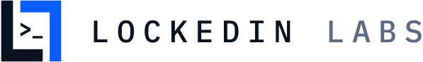
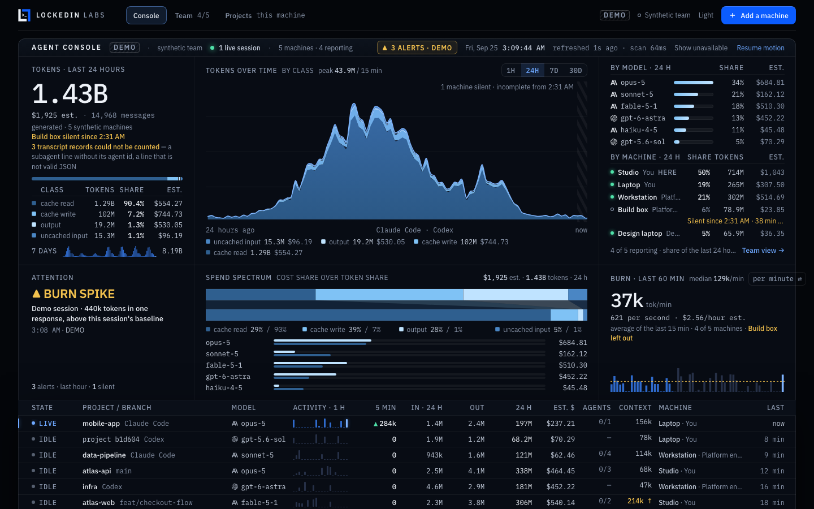
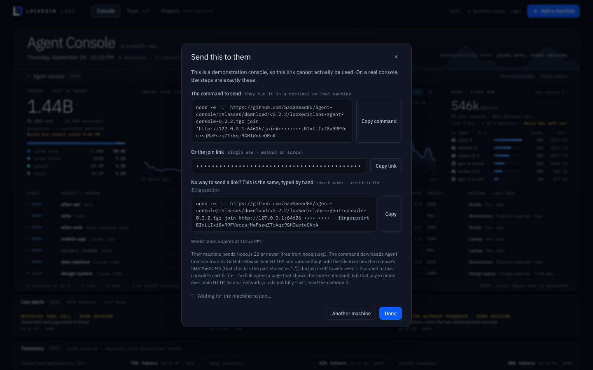
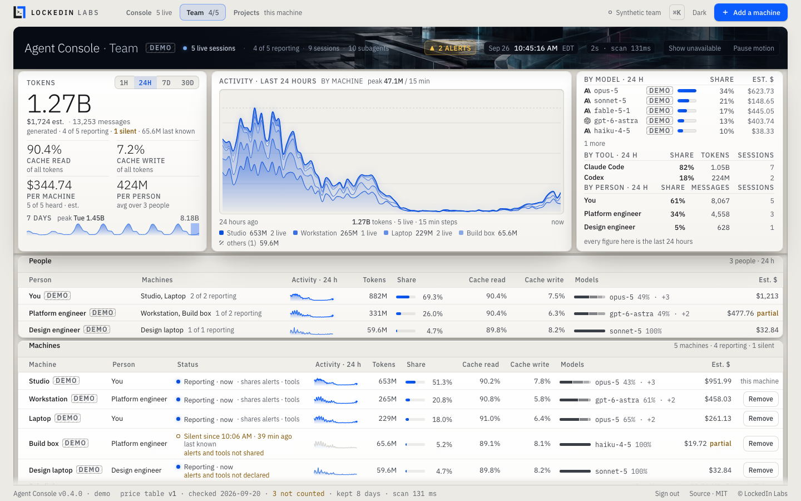

<p align="center">
  <a href="https://lockedinlabs.ai">
    <picture>
      <source media="(prefers-color-scheme: dark)" srcset="docs/brand/lockup-on-dark.svg">
      
    </picture>
  </a>
</p>

<h1 align="center">Agent Console</h1>

<p align="center">
  <a href="LICENSE"></a>
  <a href="https://github.com/SamSnead85/agent-console/releases/latest"></a>
  <a href="https://nodejs.org"></a>
  <a href="https://github.com/SamSnead85/agent-console/actions/workflows/ci.yml"></a>
</p>

<p align="center">
  See what your AI coding agents use (sessions, tokens, cache reads and writes,
  models and list-price cost) on this computer and every computer you connect.
</p>



*The console in demo mode. Every figure in this picture is generated.
[The same screen in the light theme.](docs/console-demo-light.png)*

**Only counts, model ids, timestamps, and salted hashes of session and project
identifiers leave a machine. No prompt, no response, no file path, no file
content.** One allowlist in the code enforces that, and a test pushes
real-shaped transcripts full of planted canaries through the real reporter and
the real hub and checks every byte that crosses the wire. (There is one
opt-in: `--share-project-names` also sends each project folder's *name* — never
its path. It is off unless you pass it.)

## Start here

You need a Mac, a Linux machine or a Windows PC, and about two minutes.

1. **Install Node.js 22 or newer.** Get the LTS version from
   [nodejs.org](https://nodejs.org). To check, open a terminal (*Terminal* on a
   Mac, *PowerShell* on Windows) and type `node --version` — it should say
   `v22` or higher.
2. **Start it.** Paste this into the terminal and press Return:

   ```sh
   npx --yes https://github.com/SamSnead85/agent-console/releases/download/v0.2.1/lockedinlabs-agent-console-0.2.1.tgz --open
   ```

   That fetches Agent Console from this project's GitHub release (nothing to
   download by hand) and opens it in your browser, signed in, normally at
   `http://127.0.0.1:6787`. If that port is taken, the terminal prints the
   address it used instead. Leave the terminal window open; closing it (or
   pressing Ctrl+C) stops the console. The same command starts it again.

   The first start reads the Claude Code and Codex history already on this
   computer. With months of it that can take a minute; the terminal counts the
   files as it goes, and so does the console.

**Or download it.** On the [GitHub page](https://github.com/SamSnead85/agent-console),
press the green **Code** button, then **Download ZIP**, and unzip it. You get a
folder called `agent-console-main`. In a terminal, go into that folder and
start the console:

```sh
cd ~/Downloads/agent-console-main
node bin/agent-console.mjs --open
```

On Windows (PowerShell) the first line is `cd $HOME\Downloads\agent-console-main`.
If `node` then says it cannot find `bin/agent-console.mjs`, Windows unzipped
the folder inside another one of the same name: run `cd agent-console-main`
once more. (If you use git: `git clone https://github.com/SamSnead85/agent-console.git`,
then `cd agent-console`.)

**The .tgz on the release page.** The [releases page](https://github.com/SamSnead85/agent-console/releases/latest)
lists a file named `lockedinlabs-agent-console-<version>.tgz`. It is the
packaged console that the one-line command above fetches for you. You don't
need to download or open it. *Source code (zip)* on the same page is that
release's code, used the same way as Download ZIP (its folder is named
`agent-console-<version>`).

The rest of this page writes commands as `node bin/agent-console.mjs`. If you
used the one-line command, put `npx --yes <that release link>` in its place.

Nothing to install beyond Node, no account, no build step, no dependencies.

To look around before it reads anything of yours:
`node bin/agent-console.mjs --demo --open` shows a synthetic team of five
machines. Everything on that screen is stamped **DEMO**.

### Add another computer

A teammate's laptop, your second machine, a second user account on this one:
each reports to the same console and they all add up.

1. Start the console so other computers on your network can reach it:

   ```sh
   node bin/agent-console.mjs --listen 0.0.0.0 --open
   ```

   Other computers reach it on the next port (normally `6788`); the console
   itself stays on this computer only (see
   [How the machines connect](#how-the-machines-connect)).
2. In the console, press **Add a machine**. Say whose machine it is and what to
   call it, press **Create join link**, then **Copy link** and send it to them.
3. On the other computer, they open the link and follow its one step: paste a
   single command into a terminal. It needs Node.js 22 or newer and nothing else.
   The command installs Agent Console from its GitHub release, never from your
   computer, and the join itself travels encrypted, checked against your
   console's certificate.

The machine appears on your console within seconds, and the console shows who
joined and when. A join link works **once**, for at most an hour. On the
screen the link and its code stay masked; **Copy** puts them on the clipboard.





### Signing in

The console only shows its figures to a browser that has signed in. `--open`
opens it signed in. Otherwise the terminal prints a sign-in link when the
console starts; it works once. To sign in again later, for example in another
browser, run the start command again with `--open`: it sees the console is
already running and opens it signed in.

### What works where

| | macOS | Linux | Windows |
| --- | --- | --- | --- |
| The console, reading this computer | Yes | Yes | Yes |
| Joining and reporting to another computer's console | Yes | Yes | Yes |
| Projects view (Git evidence) | Yes, with `git` | Yes, with `git` | Yes, with `git` |

CI runs the whole test suite, including the multi-process privacy test, and the
package smoke test on macOS, Linux and Windows, with Node 22 and 24.

Windows: use PowerShell, and when Windows asks whether Node.js may accept
connections on the machine running the console, allow it on private networks.

## What you see

**Tokens · last 24 hours**: the total across every machine, the list-price
estimate, the number of messages (API responses, not transcript lines), and the
split into **cache read**, **cache write**, **output** and **input**, each with
its share of all tokens. (Cache read as a share of *input tokens only*, the
other common reading, is in the cache-read tooltip, labelled as such.)

**Tokens over time**: the last hour, day or week. Where a machine has stopped
reporting, the chart says from when it is incomplete.

**Burn · right now**: tokens per minute (or per second) over the last five
minutes, the dollars per hour it implies, and each model's share and spend over
the day, with real Anthropic and OpenAI marks.

**Lanes**: one row per session: whether it is live, the project and branch, the
model, its last hour of activity, tokens in the last five minutes, how many
subagents it is running, and which machine it is on.

**Context and cache health**: the Context column shows the latest complete
input reading for an API response in each session. Open it to see the last 16
readings, growth, and possible cache breaks. A session is flagged when a
reading reaches 160,000 input tokens, or when it reaches 80,000 and doubles
from the first retained reading. The hub keeps at most 128 recent readings per
session. Streaming continuation rows are excluded, so some responses without
a complete first reading cannot be shown. A gap past the previous write's
known lifetime (five minutes or one hour), followed by a new cache write and
falling cache reads, is marked an idle-gap signal. With an unknown lifetime,
the drill-down says so; a large write within a known lifetime is marked a
possible prefix rewrite. The logs do not prove the cause. Extra cost is an estimate of the
observed cache write over a hypothetical cache read, using the offline price
table version and check date shown in the drill-down. Unpriced estimates stay
unknown. In `--demo`, the existing docs-site lane includes a synthetic break.

### Optional telemetry and metrics

Start with `--interop` to enable a local Prometheus `/metrics` endpoint and
local ingest of Claude Code OpenTelemetry and Kong or LiteLLM token metrics.
The console shows those readings in a Telemetry panel, separate from the
transcript totals so the same request is never added twice. It is off for
ordinary users. The synthetic demo shows an OpenTelemetry reading. See
[setup, accepted formats and privacy rules](docs/INTEROP.md); the included
[Grafana dashboard](docs/grafana-agent-console.json) can read `/metrics`.

### Shared analysis core

The dependency-free analysis functions are available to other Node.js consumers
through the versioned `@lockedinlabs/agent-console/analysis` subpath:

```js
import { ANALYSIS_VERSION, contextHealth } from '@lockedinlabs/agent-console/analysis';
const health = contextHealth(samples, prices);
```

`ANALYSIS_VERSION` is 1. `contextHealth` accepts only plain usage data:
`samples` contains timestamps, token counts and model IDs; `prices` contains
offline model rates, table version and check date. It returns a plain object
with context weight, growth, possible cache breaks and estimated extra cost.
No transcript text, paths, names or credentials enter the core. The console
uses this same subpath. See [the API contract](docs/ANALYSIS.md) for fields
and unknown-value behavior.

**Machines** and **Team**: every machine and every person: tokens, share of the
total, cache read and write shares, model split and cost, for 24 hours or
7 days; every join link, who used it and when. Two machines with the same
person roll up into one row.

**Projects**: this computer only: tokens per project, and what Git recorded in
the same period (commits, lines changed, pull requests merged). It is read on
this computer and never sent anywhere.

### What the numbers promise

- **A machine that stops reporting is not zero.** It shows when it was last
  heard from, its sessions show an unknown five-minute figure, and it is left out
  of "right now" by name.
- **A machine still sending its history is not complete.** A computer that
  joins with months of transcripts shows "catching up · N of M records" until
  everything has arrived, and is left out of "right now" until then. If its
  upload is interrupted it carries on from where it stopped.
- **Unknown is not zero.** A record that did not report a token class makes the
  total a floor, and the screen says so. A model with no verified list price is
  left out of the dollar figure, never priced at $0, and the screen says how
  many tokens that leaves out. If everything in the burn window is unpriced,
  the burn shows "—/hour · unpriced" rather than a dollar rate.
- **Copied transcripts count once.** Record ids come from the transcript itself,
  not from where the file sits, so the same session read on two machines is one
  set of events.
- **Dollars are estimates** at standard API list prices from a dated, offline
  table (`lib/collector/prices.json`). They are not an invoice and not a
  subscription charge. Tokens measure usage, not productivity.
- **Demo is never mixed with measured data.** A console started with `--demo`
  reads nothing, accepts no machine, and stamps DEMO on every view.

The full definitions are in [docs/MEASUREMENTS.md](docs/MEASUREMENTS.md). The
accounting rules for people, teams, models and sessions, and the conformance
suite that checks them to the token, are in [docs/accounting.md](docs/accounting.md).

## How the machines connect

One computer runs the console: the **hub**. Every other computer runs a small
**reporter** that reads *its own* Claude Code and Codex transcripts and sends the
hub metadata every ten seconds.

```
  laptop ── reporter ──┐   TLS, pinned            ┌── the console: 127.0.0.1:6787, signed in
                       ├── reporting port 6788 ──> hub
  workstation ─ reporter ┘  (device token)         └── reads its own transcripts too
```

**Two ports.** The console, its data and every button on it (making links,
removing machines) are on `127.0.0.1:6787`: this computer only, whatever
`--listen` says, and only for a signed-in browser. Other computers talk to the
reporting port, `6788`, which serves only the join page, the join exchange and
reporting. By default it listens on this computer only; `--listen 0.0.0.0` (or
a specific address) opens it to your network. It accepts callers on private
networks only (home and office ranges, Tailscale, IPv6 unique-local) unless you
pass `--allow-public`. To look at the console from elsewhere, tunnel to it:
`ssh -L 6787:127.0.0.1:6787 you@hub-computer`, then open `http://127.0.0.1:6787`.

**Encrypted and pinned.** The console makes its own TLS certificate the first
time it starts, and every join link carries that certificate's fingerprint.
Joining and reporting go over TLS, and the reporter accepts only that
certificate, so nobody on the network can read the reports or pose as your
console. The join page itself opens as plain HTTP so a browser shows no
warning; it holds no secret.

**Credentials.** A join link carries a single-use code that expires within the
hour (`--invite-minutes`, at most 60). The reporter spends it once and receives
its own device token, which it keeps in a private file (mode 600) under
`~/.agent-console/reporter/`. The token is never printed, never put in a URL and
never shown on a screen; the hub stores only a SHA-256 verifier of it. **Remove**
on the Team view revokes a machine at once (its reporter stops and says why),
and what it already reported stays, marked as removed.

**Storage.** The hub keeps 8 days of usage (`--retention-days`) in
`~/.agent-console/hub/` (`--state-dir`), one file of metadata records per day.
Nothing leaves that directory.

### The reporter

The join page gives the exact command. Written out, with the release link:

```sh
npx --yes https://github.com/SamSnead85/agent-console/releases/download/v0.2.1/lockedinlabs-agent-console-0.2.1.tgz join "<join link>"
npx --yes https://github.com/SamSnead85/agent-console/releases/download/v0.2.1/lockedinlabs-agent-console-0.2.1.tgz report
npx --yes https://github.com/SamSnead85/agent-console/releases/download/v0.2.1/lockedinlabs-agent-console-0.2.1.tgz leave
```

`join` enrols this computer, then keeps reporting. `report` keeps reporting after
a restart, with no new link. `leave` stops, and deletes everything the enrolment
left on this computer. From a download, use `node bin/agent-console.mjs` in place
of `npx --yes <release link>`. Always use the full command: the short name on
its own would fetch a different, unrelated package from the public registry.

Options: `--name` (what to call this computer), `--interval <seconds>`, `--once`,
`--state-dir`, `--home`, `--claude-root`, `--codex-root`,
`--share-project-names`, `--json`.

The reporter keeps going only while its window is open. To start it at login,
add the `report` command to your system's startup items (launchd, systemd or
Task Scheduler); this release does not install a background service for you.

## Privacy, precisely

What leaves a reporting computer, per usage event: the tool (`claude-code` or
`codex`), the model id, the minute it happened, the four token counts, whether
it was a subagent and whether it continues a message already counted, and
HMAC-SHA256 hashes of the session, its parent and the project folder. Session
hashes are keyed by a salt the hub shares only with the machines that join it,
so a copied transcript is recognised; project hashes are keyed by a secret that
never leaves the reporting computer. The machine's name is whatever the
person who made the link typed (or `--name` when joining). With
`--share-project-names` on that run, also the last part of each project
folder's name, reduced to letters, digits and dashes; run without it and names
stop at once.

What never leaves: prompts, replies, thinking, tool input and output, file
paths, file names, file contents, git branches, command lines, credentials.

On the hub's own computer the console also shows local project names and
branches, read from its own disk, shown only to the signed-in console, never
stored with the records and never sent anywhere.

The proof is `test/hub-e2e.test.js`: synthetic transcripts in the tools' real
formats, with canaries in every private field, go through a real reporter
process and a real hub process; a relay holding the hub's certificate records
every request in plain text, and the test checks the wire, the hub's files, the
reporter's files and the console's own payload for every canary. The
field-by-field contract is [docs/COLLECTOR-CONTRACT.md](docs/COLLECTOR-CONTRACT.md).

## Troubleshooting

**The console opened on a port other than 6787.** Another program had 6787,
so the console took the next free port and printed the address it used. If
Agent Console itself is already running there, a second start says so and
opens that one instead. A port you choose with `--port` is never changed: if
it is busy you are told to pick another.

**The console says "Sign in to this console".** Use the sign-in link the
terminal printed when the console started, or run the start command again with
`--open`.

**The reporter says "the hub is pacing uploads" or "catching up".** A computer
joining with a lot of history sends it in batches, and the hub paces them. Leave
the window open: every batch that arrived is kept, and the console shows the
machine as "catching up · N of M records" until it is done.

**The other computer cannot reach the console.** Check, in order: the console
was started with `--listen 0.0.0.0`; both computers are on the same network
(not a guest network); the address in the link is still this computer's address
(it can change when you change networks, so make a new link); and the firewall
allows Node.js to accept connections on the reporting port. macOS asks the
first time (choose *Allow*; or System Settings → Network → Firewall → Options),
Windows asks the same (allow *Private networks*), and on Linux with `ufw`:
`sudo ufw allow 6788/tcp`.

**"The machine at … is not the console that made this link."** The certificate
at that address is not the one named in the link: the link is for another
console, or another machine is answering at that address. Nothing was sent. Ask
for a new link.

**"This join code is not valid" or "has expired."** Each link works once, for at
most an hour. Press **Add a machine** again and send the new link.

**A machine shows "Silent since …".** Its reporter stopped: the window was
closed, the computer slept, or it changed networks. On that computer run the
`report` command (the join page shows it), with no new link. If it says the hub
no longer accepts it, it was removed: send it a new link.

**A machine shows "Joined — waiting for its first report."** It has joined but
its reporter has not delivered yet; if it stays that way, the reporter window
was closed right after joining.

**The numbers look low.** The console keeps 8 days, and the first start reads
only transcripts written in that window. Claude Code and Codex must be writing
their usual logs (`~/.claude/projects`, `~/.codex/sessions`); if yours live
elsewhere, pass `--claude-root` / `--codex-root`.

**`npx` or `node` is "not found".** Node.js is not installed, or the terminal
was opened before it was. Install it from nodejs.org and open a new terminal.

## Options

```sh
node bin/agent-console.mjs --help          # the console
node bin/agent-console.mjs join --help     # the reporter
```

| Console option | Default / purpose |
| --- | --- |
| `--open` | open the console in the browser, signed in |
| `--port <n>` | `6787`: the console, on this computer only |
| `--report-port <n>` | the port above it (`6788`): where other computers join and report |
| `--listen <address>` | `127.0.0.1`; `0.0.0.0` lets other computers reach the reporting port |
| `--allow-public` | accept reports from outside private networks |
| `--demo` | a synthetic team; reads nothing, accepts no machine |
| `--name <text>`, `--person <text>` | this computer's name, and whose it is, on the console (`This machine`, `You`) |
| `--no-local` | do not read this computer (a hub on a server) |
| `--state-dir <path>` | `~/.agent-console/hub` |
| `--retention-days <n>` | `8` (1–90) |
| `--invite-minutes <n>` | `30` (at most 60) |
| `--claude-root`, `--codex-root` | where this computer's transcripts are |
| `--json` | print launch details as JSON and keep running |

Environment equivalents use the `AGENT_CONSOLE_` prefix.

## Checking a download

From 0.2.1 on, each release's package is built by CI from the release's tag.
The release page lists its SHA-256 in `SHA256SUMS`, and GitHub keeps a signed
build provenance attestation for it. To check a file you downloaded:

```sh
shasum -a 256 lockedinlabs-agent-console-0.2.1.tgz              # macOS, Linux
Get-FileHash lockedinlabs-agent-console-0.2.1.tgz               # Windows PowerShell
gh attestation verify lockedinlabs-agent-console-0.2.1.tgz -R SamSnead85/agent-console
```

## Development

```sh
npm test               # the whole suite, including the multi-machine end-to-end tests
npm run smoke:pack     # pack, install into a scratch prefix, start it in demo mode
```

No dependencies to install. CI runs both on macOS, Linux and Windows, Node 22
and 24. See [CONTRIBUTING.md](CONTRIBUTING.md) (including the privacy rule
every change keeps) and [CHANGELOG.md](CHANGELOG.md). Report security problems
privately, as [SECURITY.md](SECURITY.md) describes. Everyone taking part agrees
to the [Code of Conduct](CODE_OF_CONDUCT.md).

## License

MIT © 2026 LockedIn Labs ([LICENSE](LICENSE), [PROVENANCE.md](PROVENANCE.md)).
IBM Plex is included under the SIL Open Font License 1.1
(`public/fonts/LICENSE-OFL.txt`). Every bundled third-party asset is listed in
[THIRD_PARTY_NOTICES.md](THIRD_PARTY_NOTICES.md).

## Trademarks

The MIT licence covers the code. It does not grant rights to the LockedIn Labs
name or marks: you may say that your work uses or is based on Agent Console,
but a modified version must not be presented as a LockedIn Labs product or use
its marks as its own. The Anthropic and OpenAI marks belong to their owners and
appear only to identify their models.

## About LockedIn Labs

Agent Console is built and maintained by [LockedIn Labs](https://lockedinlabs.ai).
