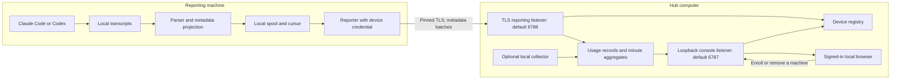
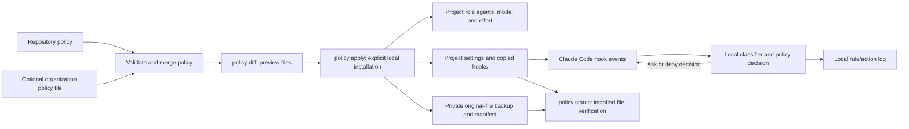
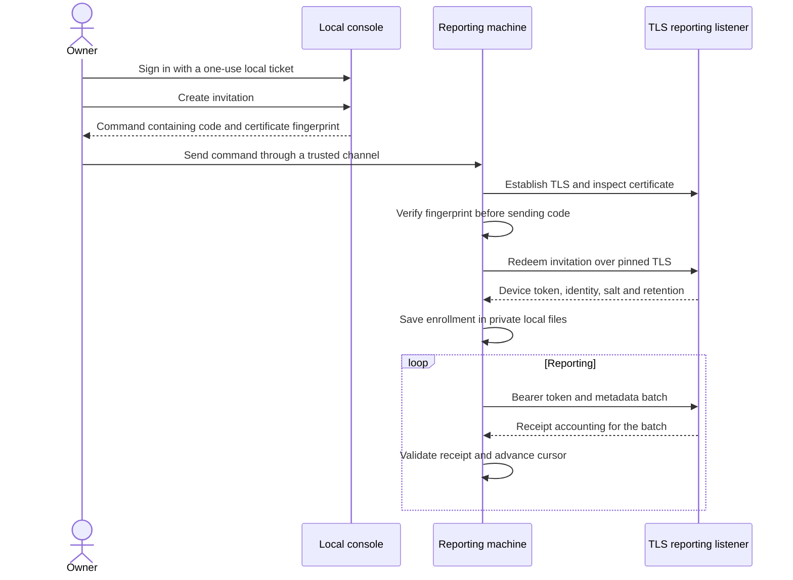
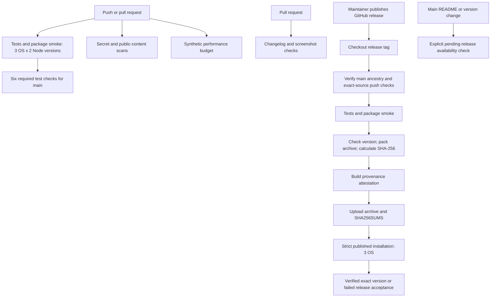
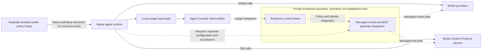

# Architecture

Agent Console provides local and fleet observability for Claude Code and
Codex. It reads usage already recorded by those tools, combines reports from
enrolled machines, and presents sessions, tokens, cache use and estimated cost
in a browser on the hub's computer. It runs on Node.js with no npm dependencies.

This document describes the integrated v0.3 source at this revision; a
published release may contain an earlier revision. The package includes
observability, an optional project policy compiler for Claude Code, and
opt-in local telemetry adapters. The separate private Enterprise gateway is
outside this package. Its implementation, deployment and controls cannot be
established by the public console's source or diagrams.

## System boundary

The dashboard and reporting hub do not sit between an agent and its model
provider. They observe recorded usage; their administrative surface manages
enrollment and removal of reporting machines. They do not receive model
requests, dispatch tools or remotely stop an agent.

Separately, `agent-console policy apply` can install local Claude Code hooks
that inspect selected tool arguments and model-switch events and return
native ask/deny decisions. Starting the dashboard does not install or
activate these controls. The agent runtime executes the hooks and retains
control of model and tool calls; this package supplies no Codex enforcement
adapter, model proxy or Model Context Protocol (MCP) gateway.

The hub can collect its own machine and accept reports from other machines.
`--no-local` disables collection on the hub. `--demo` supplies a visibly marked
synthetic team, reads no transcripts and accepts no joining machines.

Both collectors use the same projection rules. Full transcripts remain on
their source machine. The hub's local project view can additionally use local
folder names, branch names and Git history; that local view is not available
through the reporting listener.

## Data contract and accounting

The collector recognizes supported transcript usage events, derives stable
identifiers and emits an exact allowlist. Reports contain token counts, model
IDs, minute timestamps, provenance and hashed identifiers. Prompts, responses,
source files and full paths are outside the report contract.

Session and event identifiers use the organization's shared salt, allowing
copied transcripts to be counted once. Project identifiers use a key held only
by the reporting machine. `--share-project-names` is a separate opt-in for a
reduced folder name, never its full path.

The reporter spools metadata locally and sends up to 500 records per request.
It validates the receipt before advancing its delivery cursor. The receiver
validates record shape and device identity, applies reporting limits, and
classifies records as accepted, duplicate, expired or rejected. Daily record
files back the hub's in-memory minute aggregates and retention window.

Counts describe what the tools recorded. Missing classes remain unknown;
unrecognized models remain unpriced. Streaming increments, copies, forks and
counter resets have explicit accounting rules. Dollar figures use a dated,
offline list-price table; subscriptions, negotiated rates and other invoice
adjustments are not observable. Neither tokens nor Git activity measure
productivity, quality or business value.

See the [collector contract](COLLECTOR-CONTRACT.md),
[measurement definitions](MEASUREMENTS.md) and
[accounting rules and conformance fixtures](accounting.md).

The versioned `@lockedinlabs/agent-console/analysis` export contains pure
functions for context/cache signals, alerts, agent trees, spend ratios,
policy parsing and telemetry summaries. It has no filesystem, network or
runtime-control authority. Its callers supply projected data; an analytical
signal does not establish the cause of an event or enforce a policy.
See the [analysis API contract](ANALYSIS.md).

### Storage ownership and recovery

One hub owns a canonical state directory, independent of listening ports or
directory aliases. The lock uses atomic hard links on a local filesystem and
only recovers an owner that is demonstrably no longer running. Ambiguous
ownership is refused. Stop older hub processes before upgrading: older
binaries do not participate in this locking protocol.

Usage batches reach the in-memory index only after append and file flush
succeed. A failed append is rolled back; if rollback also fails, ingestion
stops until restart. Startup removes an incomplete final line and flushes
surviving records before rebuilding the index. These checks cover process
failure and retry consistency; they do not establish power-loss durability
for every filesystem or storage device.

## Optional local policy controls

Policy is an explicit installation path, independent of the running hub.
The parser accepts `agent-policy.yaml` or `agent-policy.json` in the selected
project, validates version 1 fields and defaults, and rejects unknown fields.
An explicit `--org-policy <file>` recursively overrides repository values;
arrays replace rather than merge. This is an operator-supplied file, not a
remote control-plane connection or managed organization deployment.

The compiler preserves existing settings and writes repository-scoped
`.claude/agents/`, `.claude/settings.json`, the compiled policy, and hooks.
It refuses symlinked or escaping target paths and never writes user-level
Claude settings. `policy remove` restores saved originals only if generated
files still match the install manifest. `policy status --json` reports
`installed`, `not-installed`, `drifted` or `invalid`; `runtimeVerified` stays
false because file hashes cannot prove the running agent executes the hook.

| Local control | Implemented scope | Limit |
| --- | --- | --- |
| Role agents | Generated model/effort settings and checks on explicit `Agent` model overrides | A named verification or escalation role cannot prove a test ran or count failed attempts. |
| Model changes | `PreModelSwitch` checks the model allowlist and configured prohibition on switches inside an active agent | Depends on the runtime invoking and honoring the installed hook. |
| Action gates | `PreToolUse` classifies selected shell and file tools for force pushes, credential reads, outside deletes, production migrations, policy changes and uninspected execution | Command classification is not a shell sandbox and does not cover every tool, dynamic command or MCP call. |
| Budgets | Parsed per-run/day token and dollar thresholds | No verified live balance or hard spending cutoff is available to the hook. |

Hooks use no network and log only timestamp, rule and action. On malformed
input or policy-read errors, configured `on_error` applies (default `ask`).
Classifier loading failures ask or deny even if `on_error` is `allow`.
A missing Node executable or missing/broken hook can still fail open in the
host runtime. Native permissions, sandboxing and managed settings remain
necessary; an operator or other process can change these project files.
See [policy setup, supported syntax and enforcement limits](policy.md).

## Optional telemetry interoperability

`--interop` adds these routes to the console's loopback listener only. The
reporting listener never exposes them, and starting the console does not
configure exporters, scrape gateways or send telemetry elsewhere.

| Route | Credential | Accepted data |
| --- | --- | --- |
| `GET /metrics` | `read` bearer | Prometheus text: transcript 24-hour gauges and separate optional-source gauges. |
| `POST /v1/metrics` | `ingest` bearer | OTLP/HTTP JSON delta `claude_code.token.usage` metrics; no protobuf or gRPC. |
| `POST /ingest/gateway/kong` | `ingest` bearer | Supported Kong Prometheus token counters. |
| `POST /ingest/gateway/litellm` | `ingest` bearer | Supported LiteLLM Prometheus token counters. |

Both credentials are domain-separated HMACs derived from the local admin
key. `metrics-token --scope read|ingest` retrieves the appropriate secret;
adding `--rotate` revokes that scope on the next request without disturbing
the other scope or browser sessions. Cookies, the raw admin key and the wrong
scope cannot authorize these routes. Corrupt rotation state refuses access;
the state directory must remain protected because deleting a generation file
restores the initial credential.

Ingest also requires `X-Agent-Console-Interop: 1`, rejects browser `Origin`
headers, checks content type and bounds bodies to 256 KB. The adapters keep
only counts, model IDs, timestamps and salted series hashes in bounded memory
(at most 10,000 samples); raw request bodies and identifying labels are not
retained. A restart clears this optional telemetry. OTLP retries are
deduplicated; gateway data keeps the latest cumulative value per series.

OTLP's received delta counts cover the last 24 hours. Gateway values are
cumulative snapshots, not a 24-hour spend window. Each source remains
separate from the others and from transcript totals, since they may describe
the same request. Missing sources are unavailable, not zero. A demo marks
its metrics as synthetic, exposes only a read token and refuses ingest.
These gateway routes ingest measurements; they neither proxy model requests
nor enforce a gateway's policy or budget. See [interop setup and formats](INTEROP.md).

## Enrollment and credentials

The owner creates an invitation in the local console. Its long code is random,
single-use and expires within an hour. A shorter code supports manual entry.
The reporter verifies the hub certificate fingerprint before exchanging a
code for a device token, then pins that certificate for reporting.

The hub stores token and invitation verifiers. A reporter stores its own
credential in its private state directory. Credentials do not belong in
repository files, screenshots or troubleshooting reports. Removing a machine
ends its enrollment; `leave` removes the reporter's local enrollment state.

## Trust boundaries

| Boundary | Implemented behavior | Operational meaning |
| --- | --- | --- |
| Browser to console | Loopback listener, loopback Host checks, proxy-header refusal, session cookie and API intent header | Administration is local to the hub computer. |
| Second CLI start to console | Nonce-based, port-bound mutual HMAC proof using the local admin key | An existing listener must prove its identity before a sign-in link is accepted. |
| Reporter to hub | Certificate pinning, device token, exact record validation and reporting limits | Network access alone does not enroll a machine. |
| Transcript to report | Explicit metadata projection and synthetic privacy-canary tests | Conversation content is not part of the supported report schema. |
| Local exporter or scraper to console | Opt-in loopback routes, distinct rotating read/ingest credentials, bounded projection | Telemetry access does not grant enrollment administration or transmit raw gateway labels. |
| Policy file to native agent | Explicit local compiler installation and hook decisions | Installed controls are neither runtime attestation nor model/MCP gateway enforcement. |
| Package to user | GitHub release archive, checksum and build-provenance attestation | Verify the particular downloaded artifact, not only the repository badge. |

The reporting listener defaults to loopback; `--listen` can expose it to the
local network. Public-network callers are refused unless `--allow-public` is
set. Carrier-grade NAT addresses, including common overlay-network addresses,
require `--allow-cgnat` unless public callers are explicitly allowed. The
console listener remains local regardless of those settings. Strict request
paths, bounded bodies and allowlisted static assets apply at the HTTP boundary;
ordinary console JSON responses pass through secret-pattern redaction.
Redaction is additional protection, not a guarantee that arbitrary strings
contain no secrets or an MCP request filter.

The optional join page is served over plain HTTP. A fragment is not sent in
the HTTP request, but the page and its scripts are still alterable by a
network attacker. The owner-generated command sent through a trusted channel
is the enrollment path to use on an untrusted network.

The host operating system, local account and trusted enrollment channel are
part of the security boundary. Browser cookies are scoped by host, not port;
the documented local-server limitation still applies. This public package
does not provide enterprise single sign-on, tenant isolation or provider-side
usage attestation. Read [SECURITY.md](../SECURITY.md) before network deployment.

## Component ownership

| Component | Responsibility and source |
| --- | --- |
| Entry and configuration | `bin/agent-console.mjs`, `server.js`, `lib/config.js`: command selection, configuration and listener lifecycle. |
| Collection | `lib/collector/`: parsers, projection, identity, spool, transport and pricing. |
| Reporter | `lib/reporter.js`: enrollment, local credentials, reporting and leave. |
| Admin and enrollment | `lib/hub/admin.js`, `registry.js`, `tls.js`: browser sessions, invitation/device state and hub TLS identity. |
| HTTP surfaces | `lib/hub/routes.js`, `http.js`: routing, access checks, bounded bodies, headers and static assets. |
| Response redaction | `lib/redact.js`: recognizable credential patterns masked in ordinary JSON responses; not a provider or MCP gateway. |
| Usage and views | `lib/hub/store.js`, `aggregate.js`, `accounting.js`, `projects.js`: retained records, aggregates and projections. |
| Local evidence | `lib/hub/local.js`, `lib/gitstats.js`: hub-local collection, names and Git activity. |
| Shared analysis | `lib/analysis/`: versioned, pure count-based analysis, validated policy parsing and separate telemetry summaries. |
| Project policy | `lib/policy/cli.js`, `hook.mjs`, `classify.mjs`: reversible project installation, status checks and native local hook decisions. |
| Optional interop | `lib/interop/ingest.js`, `lib/hub/metrics-token.js`, `interop-credentials.js`: projected local ingest and independently rotating telemetry scopes. |
| Browser interface | `public/`: console, enrollment page, appearance and accessibility. |
| Delivery controls | `.github/workflows/`, `scripts/`, `test/`, `bench/`: CI, packaging, regression tests and performance budgets. |

Changes to a producer and its receiver must preserve the collector contract
and conformance fixtures together. Security-boundary changes belong with
their adversarial regression tests. Performance changes retain exact record
output; see the [benchmark method and budgets](PERFORMANCE.md).

## CI and release path

The test matrix covers Linux, macOS and Windows on Node.js 22 and 24. It runs
the suite, installs and starts a packed demo, and checks for tracked changes.
Actions are pinned to commit SHAs. Most jobs have read-only repository
permissions; the release job explicitly adds upload and attestation rights.

The repository-settings snapshot from 24 September 2026 requires the six matrix
test jobs on `main`. Public-safety, performance and PR-content checks exist,
but their presence in workflow files does not make them required merge checks.
Branch protection is repository configuration and must be checked separately.

The release workflow starts **after publication**. Before packaging, it verifies
that the selected source belongs to `main` and that its latest required main-push
CI runs succeeded. It then tests, packs, attests and uploads the archive. Only a
successful upload starts strict installation acceptance on all three platforms.
The tag, README archive and running package must agree on the version; a missing
archive, timeout or failed startup fails acceptance.

Publication and a usable download remain separate states. Development pushes
can explicitly report a pending release; scheduled, manual and release checks
require a working download. Pending availability does not establish a verified
installation. See [download verification](../README.md#checking-a-download).

## Enterprise and MCP integration boundary

MCP servers expose tools to their agent clients. This public package has no
MCP server registry, MCP proxy, provider credential vault, centralized identity
service or tenant-aware control plane. Its local hook matcher covers named
native tools; it does not intercept every MCP tool. Response redaction in the
dashboard does not establish secret masking on MCP requests or responses.

Solid paths describe the public package and its runtime context; local hooks
apply only when explicitly installed and honored by Claude Code. Dashed paths
mark the separate private Enterprise integration boundary. They do not assert
that private gateway implementation is complete, deployed or protecting a
particular agent session. That requires independently verified identity,
routing, authorization, secret-handling and deployment evidence from the
Enterprise system. Agent Console's transcript and telemetry readings alone
are not proof that a gateway authorized every agent action.
