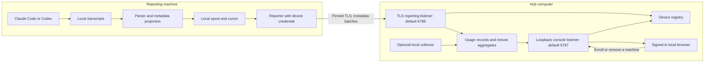
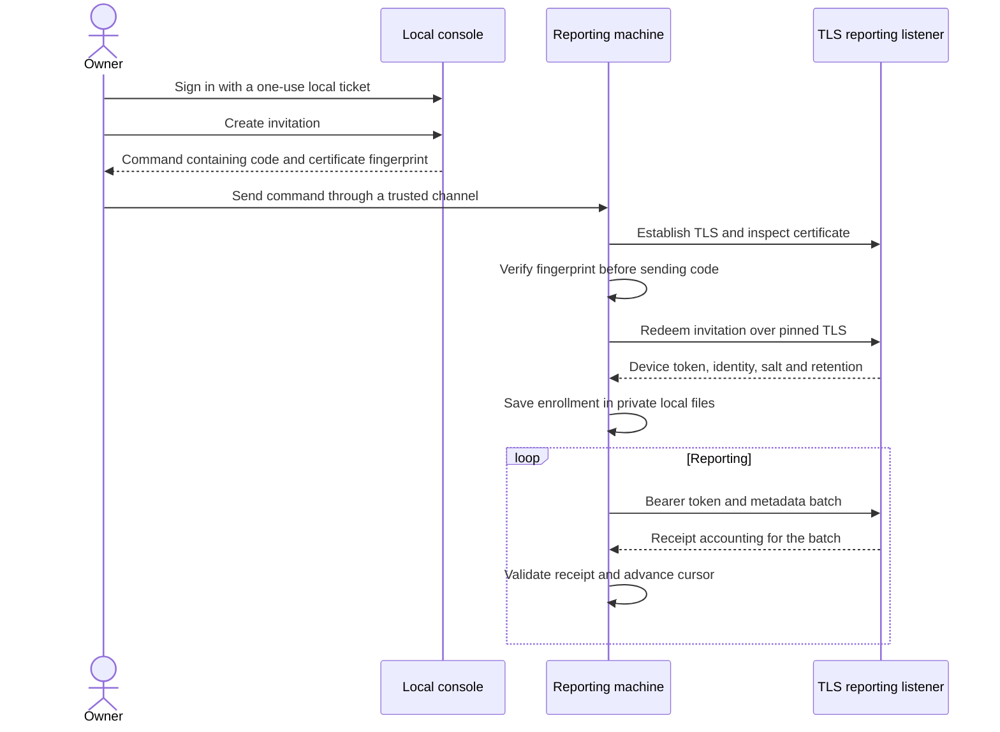
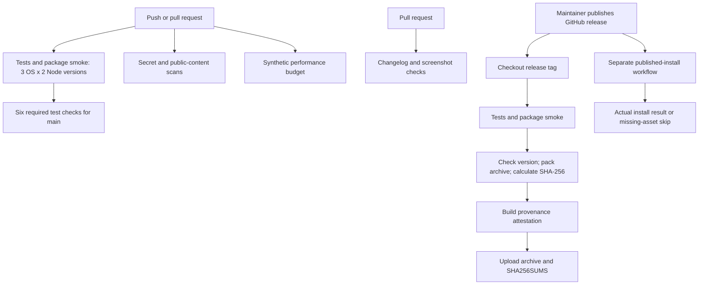
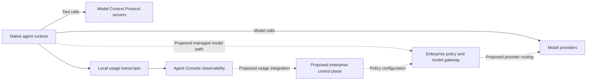

# Architecture

Agent Console provides local and fleet observability for Claude Code and
Codex. It reads usage already recorded by those tools, combines reports from
enrolled machines, and presents sessions, tokens, cache use and estimated cost
in a browser on the hub's computer. It runs on Node.js with no npm dependencies.

This document describes the source at this revision; a published release may
contain an earlier revision. The future integration
diagram is separate: a diagram of a proposed control plane is not evidence
that policy enforcement, a model gateway or an MCP gateway is shipped here.

## System boundary

The console does not sit between an agent and its model provider. It does not
receive prompts, dispatch tools, approve actions or interrupt agent execution.
Its administrative surface manages enrollment and removal of reporting
machines. The agent's own runtime retains control of model and tool calls.

The hub can collect its own machine and accept reports from other machines.
`--no-local` disables collection on the hub. `--demo` supplies a visibly marked
synthetic team, reads no transcripts and accepts no joining machines.

Both collectors use the same projection rules. Full transcripts remain on
their source machine. The hub's local project view can additionally use local
folder names, branch names and Git history; that local view is not available
through the reporting listener.

## Data contract and accounting

The collector recognizes supported transcript usage events, derives stable
identifiers and emits an exact allowlist. Reports contain token counts, model
IDs, minute timestamps, provenance and hashed identifiers. Prompts, responses,
source files and full paths are outside the report contract.

Session and event identifiers use the organization's shared salt, allowing
copied transcripts to be counted once. Project identifiers use a key held only
by the reporting machine. `--share-project-names` is a separate opt-in for a
reduced folder name, never its full path.

The reporter spools metadata locally and sends up to 500 records per request.
It validates the receipt before advancing its delivery cursor. The receiver
validates record shape and device identity, applies reporting limits, and
classifies records as accepted, duplicate, expired or rejected. Daily record
files back the hub's in-memory minute aggregates and retention window.

Counts describe what the tools recorded. Missing classes remain unknown;
unrecognized models remain unpriced. Streaming increments, copies, forks and
counter resets have explicit accounting rules. Dollar figures use a dated,
offline list-price table; subscriptions, negotiated rates and other invoice
adjustments are not observable. Neither tokens nor Git activity measure
productivity, quality or business value.

See the [collector contract](COLLECTOR-CONTRACT.md),
[measurement definitions](MEASUREMENTS.md) and
[accounting rules and conformance fixtures](accounting.md).

### Storage ownership and recovery

One hub owns a canonical state directory, independent of listening ports or
directory aliases. The lock uses atomic hard links on a local filesystem and
only recovers an owner that is demonstrably no longer running. Ambiguous
ownership is refused. Stop older hub processes before upgrading: older
binaries do not participate in this locking protocol.

Usage batches reach the in-memory index only after append and file flush
succeed. A failed append is rolled back; if rollback also fails, ingestion
stops until restart. Startup removes an incomplete final line and flushes
surviving records before rebuilding the index. These checks cover process
failure and retry consistency; they do not establish power-loss durability
for every filesystem or storage device.

## Enrollment and credentials

The owner creates an invitation in the local console. Its long code is random,
single-use and expires within an hour. A shorter code supports manual entry.
The reporter verifies the hub certificate fingerprint before exchanging a
code for a device token, then pins that certificate for reporting.

The hub stores token and invitation verifiers. A reporter stores its own
credential in its private state directory. Credentials do not belong in
repository files, screenshots or troubleshooting reports. Removing a machine
ends its enrollment; `leave` removes the reporter's local enrollment state.

## Trust boundaries

| Boundary | Implemented behavior | Operational meaning |
| --- | --- | --- |
| Browser to console | Loopback listener, loopback Host checks, proxy-header refusal, session cookie and API intent header | Administration is local to the hub computer. |
| Second CLI start to console | Nonce-based, port-bound mutual HMAC proof using the local admin key | An existing listener must prove its identity before a sign-in link is accepted. |
| Reporter to hub | Certificate pinning, device token, exact record validation and reporting limits | Network access alone does not enroll a machine. |
| Transcript to report | Explicit metadata projection and synthetic privacy-canary tests | Conversation content is not part of the supported report schema. |
| Package to user | GitHub release archive, checksum and build-provenance attestation | Verify the particular downloaded artifact, not only the repository badge. |

The reporting listener defaults to loopback; `--listen` can expose it to the
local network. Public-network callers are refused unless `--allow-public` is
set. The console listener remains local regardless of that setting.

The optional join page is served over plain HTTP. A fragment is not sent in
the HTTP request, but the page and its scripts are still alterable by a
network attacker. The owner-generated command sent through a trusted channel
is the enrollment path to use on an untrusted network.

The host operating system, local account and trusted enrollment channel are
part of the security boundary. Browser cookies are scoped by host, not port;
the documented local-server limitation still applies. This public package
does not provide enterprise single sign-on, tenant isolation or provider-side
usage attestation. Read [SECURITY.md](../SECURITY.md) before network deployment.

## Component ownership

| Component | Responsibility and source |
| --- | --- |
| Entry and configuration | `bin/agent-console.mjs`, `server.js`, `lib/config.js`: command selection, configuration and listener lifecycle. |
| Collection | `lib/collector/`: parsers, projection, identity, spool, transport and pricing. |
| Reporter | `lib/reporter.js`: enrollment, local credentials, reporting and leave. |
| Admin and enrollment | `lib/hub/admin.js`, `registry.js`, `tls.js`: browser sessions, invitation/device state and hub TLS identity. |
| HTTP surfaces | `lib/hub/routes.js`, `http.js`: routing, access checks, bounded bodies, headers and static assets. |
| Usage and views | `lib/hub/store.js`, `aggregate.js`, `accounting.js`, `projects.js`: retained records, aggregates and projections. |
| Local evidence | `lib/hub/local.js`, `lib/gitstats.js`: hub-local collection, names and Git activity. |
| Browser interface | `public/`: console, enrollment page, appearance and accessibility. |
| Delivery controls | `.github/workflows/`, `scripts/`, `test/`, `bench/`: CI, packaging, regression tests and performance budgets. |

Changes to a producer and its receiver must preserve the collector contract
and conformance fixtures together. Security-boundary changes belong with
their adversarial regression tests. Performance changes retain exact record
output; see the [benchmark method and budgets](PERFORMANCE.md).

## CI and release path

The test matrix covers Linux, macOS and Windows on Node.js 22 and 24. It runs
the suite, installs and starts a packed demo, and checks for tracked changes.
Actions are pinned to commit SHAs. Most jobs have read-only repository
permissions; the release job explicitly adds upload and attestation rights.

The repository-settings snapshot from 24 September 2026 requires the six matrix
test jobs on `main`. Public-safety, performance and PR-content checks exist,
but their presence in workflow files does not make them required merge checks.
Branch protection is repository configuration and must be checked separately.

The current release workflow starts **after publication**, then tests, packs,
attests and uploads the archive. Publication and a usable download are therefore
separate states. The README-install workflow returns a successful skip when
the archive is missing with HTTP 404. A green skipped job is not install
acceptance: release completion needs the uploaded artifact and an actual
successful installation of that version. See [download verification](../README.md#checking-a-download).

## Future integration context — not shipped in this package

Model Context Protocol (MCP) servers expose tools to their agent clients;
this console neither supplies that gateway nor enforces those calls. The
solid paths show the surrounding runtime relationship and the existing
observation boundary. Dashed paths describe possible enterprise integration,
not controls implemented by the public console.

An enterprise gateway, policy decisions, centralized authentication and a
shared control plane require their own implementation, deployment and security
acceptance. Until that integration is delivered, Agent Console's evidence is
device-reported usage, not proof that a policy authorized every agent action.
